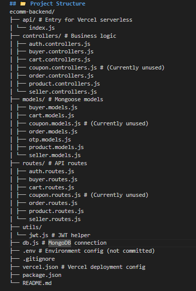

# 🛠️ E-Commerce Web App – Backend (Express + MongoDB)

This is the backend API for the full-stack e-commerce application, built with **Node.js**, **Express.js**, and **MongoDB** using **Mongoose**. It powers both buyer and seller functionality and connects to the Angular 19 frontend.

🔗 **Frontend Live Demo:** [https://e-commerce-six-ecru-38.vercel.app/](https://e-commerce-six-ecru-38.vercel.app/)

---

## 🗂️ System Architecture

Below is the architecture diagram of the full-stack application:


---

## ⚙️ Features

- ✅ **Buyer & Seller Authentication**
  - JWT-based login system
  - Encrypted passwords with `bcryptjs`
  - Separate login/register APIs for buyers and sellers

- 🛒 **Product Management**
  - Sellers can create, update, and delete products
  - Buyers can view filtered products with pagination

- 📬 **OTP Email Verification**
  - OTP-based email verification
  - Uses `nodemailer` for sending OTPs

- 🔐 **Security & Middleware**
  - Passwords hashed before saving
  - CORS configured for frontend/backend communication
  - Global error handling middleware
  - MongoDB connection with a custom DB handler

---

## 📁 Project Structure
Below is the Project Structure of the Back-end application:



---

## 🔧 Tech Stack

| Technology     | Purpose                         |
|----------------|----------------------------------|
| Express.js     | Backend framework                |
| MongoDB        | Database                         |
| Mongoose       | ODM for MongoDB                  |
| JWT            | Authentication                   |
| BcryptJS       | Password encryption              |
| Nodemailer     | OTP email service                |
| dotenv         | Environment variable handling    |
| CORS           | Cross-origin access              |

---

## 🧪 Sample API Endpoints

| Endpoint                         | Method | Description                          |
|----------------------------------|--------|--------------------------------------|
| `/api/buyer/signup`              | POST   | Buyer registration with OTP          |
| `/api/seller/signup`             | POST   | Seller registration with OTP         |
| `/api/products?search=&page=`    | GET    | Product list with filter + pagination|
| `/api/buyer/cart`                | POST   | Add product to buyer's cart          |
| `/api/buyer/orders`             | GET    | Get all orders placed by buyer       |

➡️ _Full list available in the `routes/` folder_

---


## ⚙️ Setup Instructions

1. **Clone the repository**

```bash
git clone https://github.com/ChintuSitlani/E-Commerce-Backend.git
cd E-Commerce-Backend

Install dependencies
npm install

Run the development server
ng serve

.App will run locally at:
👉 http://localhost:3000

---

## 🌐 Environment Variables (`.env`)

```bash
PORT=3000
MONGO_URI=your_mongodb_connection_string
JWT_SECRET=your_jwt_secret
EMAIL_USER=your_email@example.com
EMAIL_PASS=your_email_password_or_app_password

---

🌐 Deployment
This backend is deployed using Vercel serverless functions:
🔗 API Base URL: https://ecomm-backend-pink.vercel.app/api

🙋‍♂️ Author
Chandra Prakash Sitlani
GitHub Profile :- https://github.com/ChintuSitlani/


📄 License
This backend project is open for personal, educational, and portfolio use.
⚠️ Commercial usage is not permitted without explicit permission.

